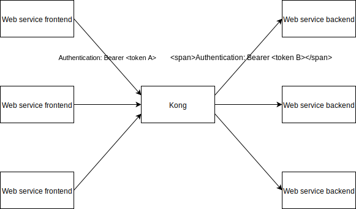

# Case - Gateway Authorization Control

## Requirements



### Description

* Kong implementation is required to control different request access
* Correct combination of Host and Authorization can be forward to corresponding upstream server
* Corresponding Authorization token should be updated to pass the corresponding backend's authorization
* [Kong Plugins](https://docs.konghq.com/hub/) should be used

## Idea - Plugin should use

* Key Authentication - reads bearer token authentication to recognise the Consumer
* ACL - limit which Consumer can use the Service
* Request Transformer - changes the request depends to condition it defined

## Implementation

```bash
curl -X POST \
  http://localhost:8001/services/ \
  -H 'Content-Type: application/json' \
  -d '{
    "name": "<backend service name>",
    "url": "<backend service url>"
}'
```

Add service to Kong. [API Reference](https://docs.konghq.com/1.0.x/admin-api/#add-service)

```bash
curl -X POST \
  http://localhost:8001/services/<backend service name>/routes \
  -H 'Content-Type: application/json' \
  -d '{
    "paths": ["<path>"]
}'
```

Add Route to the service. [API Reference](https://docs.konghq.com/1.0.x/admin-api/#add-route)

```bash
curl -X POST \
  http://localhost:8001/services/<backend service name>/plugins \
  -H 'Content-Type: application/json' \
  -d '{
    "name": "key-auth",
    "config":{
        "key_names": ["Authorization"]
    }
}'
```

Assign `Key Authentication` to the service. [API Reference](https://docs.konghq.com/hub/kong-inc/key-auth/)

```bash
curl -X POST \
  http://localhost:8001/consumers/ \
  -H 'Content-Type: application/json' \
  -d '{
    "username": "<consumer username>"
}'
```

Add Consumer to the Kong. [API Reference](https://docs.konghq.com/1.0.x/admin-api/#create-consumer)

```bash
curl -X POST \
  http://localhost:8001/consumers/<consumer username>/key-auth \
  -H 'Content-Type: application/json' \
  -d '{
    "key": "Basic <key>"
}'
```

Assign `Key Authentication` into the customer, request that contains the key will be treated as the customer. [API Reference](https://docs.konghq.com/1.0.x/admin-api/#add-route)

```bash
curl -X POST \
  http://localhost:8001/services/<backend service name>/plugins \
  -H 'Content-Type: application/json' \
  -d '{
    "name": "acl",
    "config": {
        "whitelist": ["<customer group name>"]
    }
}'
```

Assign `ACL` into the service, only customers in the group and access the backend service. [API Reference](https://docs.konghq.com/hub/kong-inc/acl/)

```bash
curl -X POST \
  http://localhost:8001/consumers/<consumer username>/acls \
  -H 'Content-Type: application/json' \
  -d '{
    "group": "<customer group name>"
}'
```

Assign customer into the ACL group. [API Reference](https://docs.konghq.com/1.0.x/admin-api/#add-route)

```bash
curl -X POST \
  http://localhost:8001/consumers/a1eead80-dbb7-406b-983c-d27232619f8b/plugins \
  -H 'Content-Type: application/json' \
  -d '{
    "name": "request-transformer",
    "config": {
        "remove": {
            "headers": ["Authorization"]
        },
        "add": {
            "headers": ["Authorization: Basic <another token>"]
        }
    }
}'
```

Assign `Request Transformer` into the customer, for all requests that recoginised as the customer will perform the request transform. [API Reference](https://docs.konghq.com/hub/kong-inc/request-transformer/#enabling-the-plugin-on-a-consumer)

