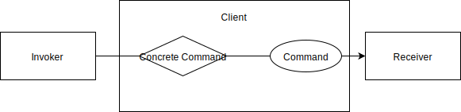
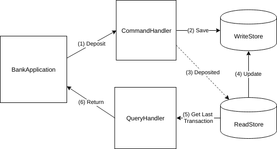

# Command Pattern



Command is the concept that encapsulating the Request into on object. The object is so-called `Command`. 

## Features

* Reduce coupling between the Client and Service
* Standardize the Request into uniformed object
* Behaviors of Command can be configured, like:
  * Callbacks / Error handling
  * Transactions / Logs
  * Undo / Redo

## Code snippet example

```python
interface Command {
    function execute()
}

// Concrete Command
class Order implements Command {
    Cook cook;
    Meal meal;

    execute() {
        cook.prepare(meal);
    }
}

// Receiver
interface Cook {
    function prepare(Meal meal)
}

// Invoker
class Customer {
    Order order;
    Meal meal;

    mailOrder(Order order) {
        order.execute()
    }
}

// Client
class Restaurant {
    Cook cook;
    Customer customer;

    main() {
        order = new Order(cook, customer.meal)
        customer.mailOrder(order)
    }
}


```




1. The Application \(Client\) creates the `Deposit` command and calls the `handle_deposit` method on the Command Handler \(Command Invoker\)
2. The WriteStore \(Command Receiver\) saves data
3. Right after the Command Handler fires an event to notify the ReadStore \(Query Receiver\) which updates
4. The Application \(Client\) then creates the `GetLastDeposit` query and calls the `handle` method on the QueryHandler \(Query Invoker\)
5. The ReadStore \(Query Receiver\) will then save the value into the query
6. The result stored in the query returns to the user

## References




