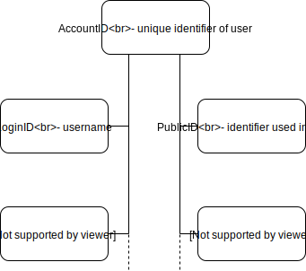

# Tripartite Identity Pattern

LoginIDs allow user to login the same account with multiple ways \(Just affects the types of DB tables and the adapters\), or allow multiple access of login with same authentication \(e.g. Gitlab's multiple SSH user key\)

PublicIDs indicates how the external services indicates the User, but they could be same \(there has many people in the world with the same name\). PublicID must not be the unique identifier of the user.

## Reference



