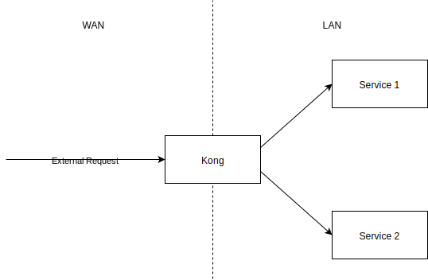

# Tool - Kong

## Overview

Kong is an proxy.

Kong acts as an API gateway, which as an entrance of API endpoints and pass them to dedicated servers \(mostly internal network\).



### Dependency

OpenResty\(Nginx + Lua\) as base for Nginx's proxy performance and Lua's additional feature on top of Nginx.

Lua for plugin scripting due to it's lightweight and embeddable.

Apache Cassandra or PostgreSQL as database due to performance and clustering.

### Feature

Uses as router to forward the requests from client side to server side according to the endpoint/domain/hostname of request.

Additional function provided by plugin.

All configuration\(routing\) will synced along all nodes and clusters. i.e. scalable

### Characteristic

RESTful API, although some open source projects provides GUI.

Due to build on top of Openresty\(Nginx + Lua\), it gets benefits from both application:

Fast. Benefit from Nginx and cache management of database.

Plugin available, which is Lua-scripted.

## Getting Started

### Installation



`docker-compose up`

`-d` flag may needed to detach the service.

### Usage

Kong accepts HTTP API for administration.

8000 and 8443 are ports used for Kong proxy of HTTP and HTTPS respectively.  
8001 and 8444 are HTTP/HTTPS Kong Admin API port.

2 type of format accepted for every Admin API:

* application/x-www-form-urlencoded  

  This accepts the form input format. Dotted key needed for complex value input, e.g.:

  `config.limit=10&config.period=seconds`

* application/json

  JSON format representation is easy for complex data.

  ```javascript
  {
      "config": {
          "limit": 10,
          "period": "seconds"
      }
  }
  ```

More [detailed reference](https://docs.konghq.com/1.0.x/admin-api/#supported-content-types)

## Terminology

### Service

General name of upstream. e.g. product, API provider, microservice, etc.

Key attribute of Service is the URL \(destination of the Service lies in, Kong will forward requests to there\) which consists `protocol`, `host`, `port` and `path`.

### Route

Route defines the entrypoints of the Kong proxy.

Route must bind to an service, and the requests meets the conditions Route defined will be forwarded to the service it belongs.

Kong only accepts requests sent to Route, and proxies it to it's corresponding Service.

`protocols`, `methods`, `hosts`, `paths` identifies the entrypoints.

### Consumer

Indicates the user of Service.

Used to distinguish the requests into different users, Plugins may have further handling on this.

### Plugin

Plugin can use to intercept during HTTP request/response lifecycle.

Plugin can apply to `Service`, `Route` and/or `Consumer`, or apply it globally.

The plugins with more specific condition of API will have higher priority to execute.

One Plugin will be run only once per HTTP request/response.

### Certificate

Used to indicate public certificate/private key pair of SSL certificates.

Kong uses this to handle SSL/TLS termination for encrypted requests.

### SNI

Mapping of hostnames to Certificate.

### Upstream

Hostname used to be upstream destination of Service. Can contain multiple for load balance.

It also contains Health Checker which monitors the Upstream is available to serve request or not.

### Target

IP address or hostname with a port that identifies an instance of a backend service.

Targets cannot be deleted or modified, only can be disabled.

## Resources

Reference - [https://docs.konghq.com/1.0.x/admin-api](https://docs.konghq.com/1.0.x/admin-api)

Plugin for Kong - [https://docs.konghq.com/hub/](https://docs.konghq.com/hub/)

Konga, the non-official GUI of Kong: 



